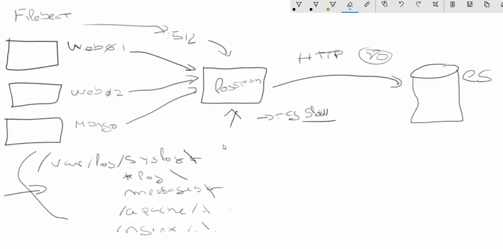
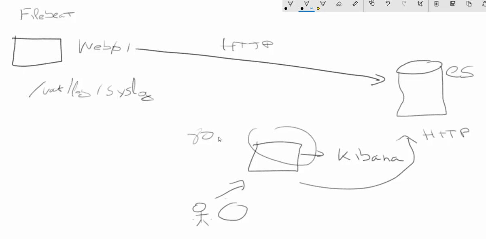
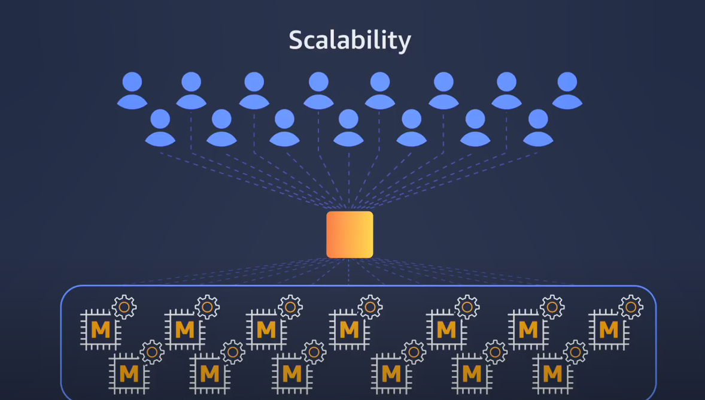

# Indice
- [ELK Stack (Elastic Stack)](#elk-(elastic-stack))
- [CloudFront](#cloudfront)
- [ElatiCache](#elasticache)
<br />

# ELK (Elastic Stack)
Se compone por varios comopentes:
- Elastic Search
- Log Stash
- Kibana
https://www.elastic.co/products/
<br />

### Elastic Search
Una base de datos donde solo vamos a poder almacenar cadenas de texto, en este caso estas cadenas de texto van a ser lineas de nuestro log.<br />
Esta optimizado para realizar busquedas rapidas, casi instantaneas sobre difernetes indices donde se van a almacenar estos logs.<br />
Vamos a tener una base de datos donde vamos a poder comunicarnos utilizando HTTP y esto nos va a devolver un fichero JSON<br /><br />

Vamos alevantarlo desde el servicio de **Amazon ElasticSearch Service**

### Log Stash
Podemos cetralizar los Logs y hacer transformaciones de ellos antes de mandarlos a la bd (ElasticSearch), o mandarlo directamente a la base de datos

### Kibana
Interface grafico, mediante el cual vamos a poder ver esos datos de diferentes formas.<br />
Diferentes graficas, el link es https://www.elastic.co/kibana <br/>

### Beats
Agente que se empezo a implementar con las ultimas versiones, nos permite enviar los datos a una estancia central. Tiene una familia de implementaciones como **filebeat** para archivos<br />
https://www.elastic.co/beats/
<br /><br />

### Infra
Infraestructura clasica<br />
Generamos 3 instancias y en cada una instalamos **filebeat**, se va a encargar de monitorizar nuestros logs en cada instancia y ver cuales son las nuevas lineas. Una vez echo eso debemos configurar **filebeat** para que se comunique con el **LogStash** central, y este que envie la informacion al **ElasticSearch**



Nosotros vamos a saltar la parte de **LogStash** y mediante **FileBeat** mandamos la informacion al **ElasticSearch**. Vamos a tener que tener instalada en alguna instancia **Kibana**, que es una aplicacion web



### Creamos un nuevo ElasticSearch 

- GetStarted
- Colocamos el domine y una version
- Numero de instancias (nodos en el cluster) y el tipo de instancia
- Tipo de almacenamiento, elegimos EBS, dependiendo de esto va a ser mas rapido o lento
- elegimos Purpose (SSD) que es el mas sencillo con un volumen de 10
- Politicas de accesos, diferentes opciones
  - Restringir el acceso a algunas cuentas
  - Opcion para IPS o rango de IPS
  - Denegar todo
  - Permitir todo (lo que vamos a hacer)
- Confirmar y crear
<br />

**UNA VEZ CREADO**
- Vemos 2 enpoints
  - Enpoint donde vamos a mandar las peticiones
  - El otro es el de Kibana


### Creamos una instancia EC2
Instalamos **FileBeat** -> https://www.elastic.co/guide/en/beats/filebeat/current/filebeat-installation.html
```sh
curl -L -O https://artifacts.elastic.co/downloads/beats/filebeat/filebeat-7.8.0-amd64.deb
sudo dpkg -i filebeat-7.8.0-amd64.xdeb

service filebeat status # Probamos si esta instalado

cd /etc/filebeat/
nano filebeat.yml # Vamos a editar este fichero, que tiene la configuracion
```
Podemos excluir lineas, incluir lineas, excluir ficheros (lo activamos), podemos agregar diferentes niveles de debug, podempos darle un nombre (sino recibe el hostname de la instancia), campos adicionales como env<br />
Vamos a mandar todo lo que concida con la cadena /var/log/*log<br />
En el fichero, en **paths** colocamos /var/log/*log (podemos agregar varios uno abajo del otro)<br />
Todo los logs de ese fichero los va a enciar, salvo los .gz<br />
Tenemos la parte de la salidas, podemos mandar los ficheron a elasticsearch o a un logstash. Podemos agregarle
seguridad para acceder con un ssl o con un usuario y password (para uno o para otro)<br />
Vamos a correrlo en ES, para eso modificamos el **hosts** y agregamos el EndPoint del ES que creamos con el puerto **80**<br /><br />
Hacemos una prueba haciendole un curl al endpoint para ver si llegamos correctamente<br />
```sh
curl {enpoint}/_cat/indices?v # Lista de indices de nuestro ES
curl {enpoint}/_cat/health?v # Salud de nuestro cluster
curl {enpoint}/.kibana/ # Le pasamos un indice '.kibana', nos devuelve el contenido de ese indice
curl {enpoint}/.kibana/?pretty # Para que nos devuelva algo mejor visible
```
```sh
service filebeat status # Veo si esta activo o inactivo
service filebeat start # Inicio el servicio FileBeat

curl {enpoint}/_cat/indices?v # Ahora veo que empieza a enviar datos ES
curl {enpoint}/{indice que se creo}/?pretty # Veo que lo devuelve

# Podemos ver los logs
tail -f /var/log/syslog
tail -f /var/log/filebeat/filebeat

logger -t test hello # Agrego un log para ver como crene el JSON y manda los datos
```

### Abrimos Kibana
- Management > Index name or pattern
- Le agregamos filebeat-* (todos los indices que empiezan con **filebeat**)
- Crear
- Vamos a Discover y vemos que ya tenemos datos
  - Kibana indica que cada linea del log va a ser un campo diferente
  - Podemos agregar diferentes campos

### Creamos una nueva instancia EC2
Creamos una instancia identica a la que generamos antes

- Instalamos **filebeat**
- Hacemos lo mismo que hicimos en el anterior
  - Hacemos el curl para instalarlo
  - editamos el fichero de configuracuib **filebeat.yml**
  - paths y salidas igual que la primera instalacion
  - y cambiamos el nombe a web02 (dejar un espacio entre el name: y el nombre, name: web02)
  - ejecutamos **service filebeat start**
  - vemos el status **service filebeat status** para ver si levanto bien

### Kibana
Vemos ahora como vienen del beat.name web02

- Vamos a Dashboard, creamos uno nuevo en save
- vamos a Open y lo vemos
- Vamos a elementos de visualizacion y seleccionamos alguno, como el pie
- Lo creamos sobre un indice filebeat.*
- Puedo añadir valores
- Agregamos un termino para separar
- Voy al Dashboard, le doy **add** y puedo añadirlo, puedo cambiar el tamaño, etc..
- Puedo elegir si puedo ver, ultimos 15, ultimos 30, ultimo años, etc..
- Para hacer campos personalizados utilizariamos **logstash**
- CReamos otro Pie
- termino por el sorce para saber por que log vienen
- podemos buscar de una manera compleja las visualizaciones
- En management podemos ver el lenguaje de las busquedas

<br />

# CloudFront
Me permite cachear el continido estatico de mi aplicacion, mejora mucho la latensia.<br />
El objetivo es cachear el contenido en todos los Edge de AWS, para que el contenido este mas cerca de donde la persona se esta conectando y solucionar el tema de la latensia<br />
<br />
Hay 2 contenidos:
- RTMP: mas para contenido multimedia, Streaming, videos, etc..
- Web: archivos, ficheros, etc..
<br /><br />

TTL (Time To Live):
- Minimo TTL: contenido en segundos
- Maximo TTL: 
- Default TTL: 24h -> significa que mi CF va a cachear por defecto 24horas
<br /><br />
Podemos poner un Firewall, certificados<br />
Tarda entre 5 y 10 minutos
<br /><br />

**Pasos a seguir**
- Creamos un S3
- subimos un index.html y una imagen para probar
- Vamos a CloudFront
- damos click a Create Distribution
- Podemos elegir contenido estatico (web) o RTMP, elegimos Web
- Elegimos el dominio, el s3 que creamos
- Damos yeas a Restrict Bucket access
- Create a new Identity
- Grant Read permissions (yes)
- Crear districucion

<br />


# ElastiCache

### MemCached
Base de datos en memoria ram para cachear los datos y que la obtencion de ellos sea
mucho mas rapida, trabaja con Clave-Valor al igual que Redis<br />
Pero el mantenimiendo de todo esto puede ser muy desafiante, por eso aparece **ElastiCache**<br />
**ElastiCache** es un full managed de MemCached que nos permite administrar tareas,
mucho mas facil de escalar


<br />
